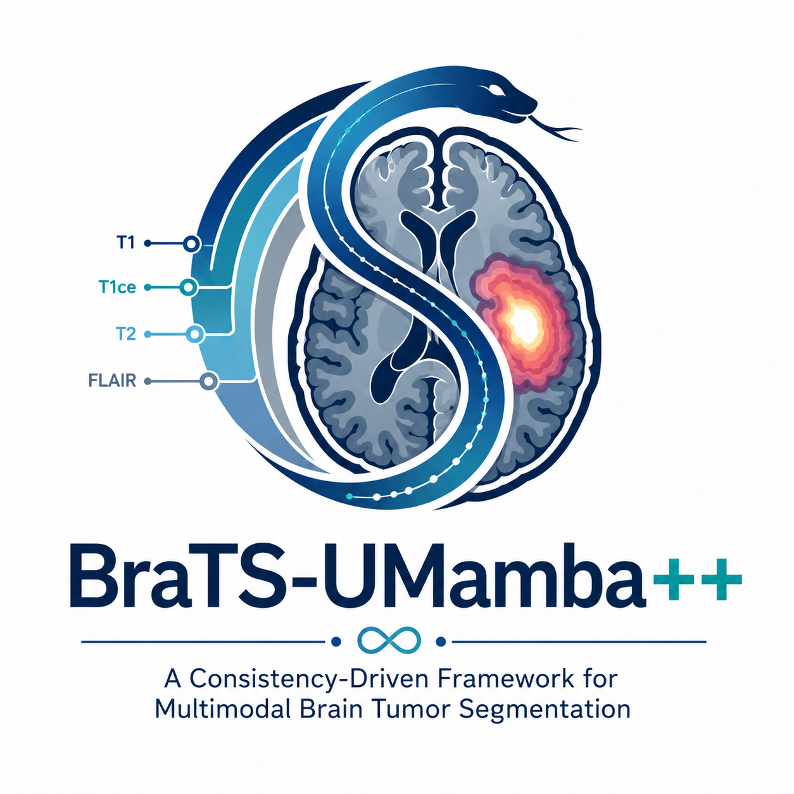
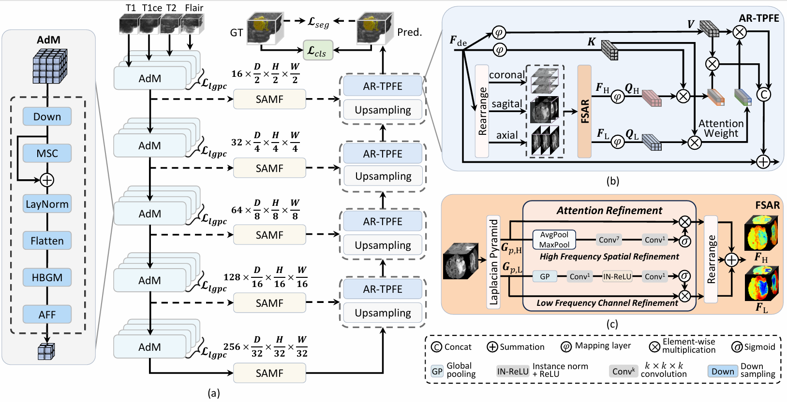
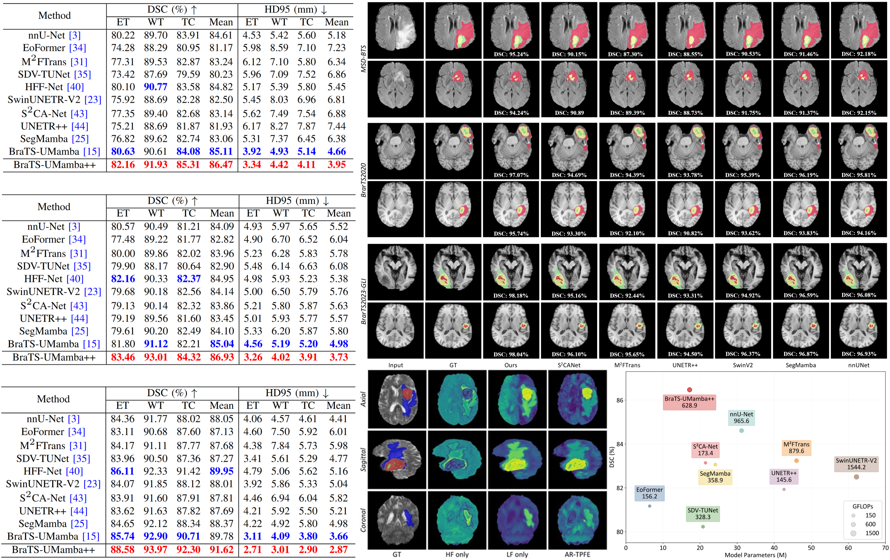

<table>
<tr>
<td align="left">
  <h1 style="margin: 0;">
    <em>IEEE TMI 2026</em><br>
    BraTS-UMamba++: A Consistency-Driven Framework for Multimodal Brain Tumor Segmentation
  </h1>
</td>
<td align="right">
  
</td>
</tr>
</table>
<p align="left">
  <a href="#overview">
    
  </a>
  <a href="#datasets">
    
  </a>
  <a href="#training">
    
  </a>
</p>
<a id="overview"></a>

## Overview
<div align=center>  

</div>

(a) Overall architecture of **BraTS-UMamba++**, a consistency-driven framework for multimodal brain tumor segmentation. The encoder performs **topology-aware sequence modeling**, skip connections enable **semantic alignment via subregion-aware fusion**, and the decoder **refines reconstruction using tri-plane frequency-guided structural cues**, (b) Attention-Refined Tri-Plane Frequency Enhancement (AR-TPFE) module, and (c) Frequency Specific Attention Refinement (FSAR) block in the AR-TPFE module.

<div align=center>  

</div>
Some experimental results for illustration. For more details, please refer to our paper.


---

## 🛠️ Install Dependencies
Clone this repo and install environment:
```
git clone https://github.com/hualei213/BraTSUMamba_plus_plus.git
conda create -n BraTSUMamba_plus_plus python=3.8
conda activate BraTSUMamba_plus_plus
pip install -r requirements.txt
```
<a id="datasets"></a>

## 📦 Datasets Preparation

### 1. Download
 Datasets Preparation
Please download and prepare the following training datasets:


- [MSD-BTS](https://decathlon-10.grand-challenge.org/) Brain Tumor (Task 01_BrainTumour)  is available from via [AWS](http://medicaldecathlon.com/dataaws/) or [Google Drive](https://drive.google.com/drive/folders/1HqEgzS8BV2c7xYNrZdEAnrHk7osJJ--2).
- [BraTS 2020](https://www.med.upenn.edu/cbica/brats2020/data.html) is also now available for download on [Kaggle](https://www.kaggle.com/datasets/awsaf49/brats20-dataset-training-validation).
- To download [BraTS 2023-GLI](https://www.synapse.org/Synapse:syn51156910/wiki/621282), simply create an account on Synapse and register for the challenge on the official website.


Example preprocessing code for Colorectal dataset:
```
import shutil
from batchgenerators.utilities.file_and_folder_operations import join, subdirs, maybe_mkdir_p
from nnunetv2.dataset_conversion.generate_dataset_json import generate_dataset_json
from nnunetv2.paths import nnUNet_raw

if __name__ == '__main__':
    brats23_data_dir = '/mnt/SSD2/YHR/dataset/BraTS2023-GLI/BraTS2023_Fold_1/imagesTr'

    task_id = 2023001
    task_name = "BraTS2023_GLI"

    foldername = "Dataset%03.0d_%s" % (task_id, task_name)

    out_base = join(nnUNet_raw, foldername)
    imagestr = join(out_base, "imagesTr")
    labelstr = join(out_base, "labelsTr")
    maybe_mkdir_p(imagestr)
    maybe_mkdir_p(labelstr)

    case_ids = subdirs(brats23_data_dir, join=False)


    for c in case_ids:
        shutil.copy(join(brats23_data_dir, c, c + "-t1n.nii.gz"), join(imagestr, c + '_0000.nii.gz'))
        shutil.copy(join(brats23_data_dir, c, c + "-t1c.nii.gz"), join(imagestr, c + '_0001.nii.gz'))
        shutil.copy(join(brats23_data_dir, c, c + "-t2w.nii.gz"), join(imagestr, c + '_0002.nii.gz'))
        shutil.copy(join(brats23_data_dir, c, c + "-t2f.nii.gz"), join(imagestr, c + '_0003.nii.gz'))

        shutil.copy(join(brats23_data_dir, c, c + "-seg.nii.gz"), join(labelstr, c + '.nii.gz'))


    generate_dataset_json(
        out_base,
        channel_names={0: 'T1n', 1: 'T1c', 2: 'T2w', 3: 'T2f'},
        labels={
            'background': 0,
            'whole tumor': (1, 2, 3),
            'tumor core': (1, 3),
            'enhancing tumor': (3, )
        },
        num_training_cases=len(case_ids),
        file_ending='.nii.gz',
        regions_class_order=(1, 2, 3),
        license='BraTS',
        reference='BraTS 2023 GLI',
        dataset_release='1.0'
    )
```

<a id="training"></a>

## 🚀 Training & Evaluation
```
TASK_ID=2023001
CV="all"
dataset="BraTS2023_GLI"
# ================= train =================
BraTSUMambav2_train ${TASK_ID} 3d_fullres all
INPUT_IMG_DIR="/BraTSUMamba_plus_plus/BraTSUMambav2_train_raw/Dataset${TASK_ID}_${dataset}/imagesTs"
OUTPUT_ROOT="/BraTSUMamba_plus_plus/BraTSUMambav2_train_results/Dataset${TASK_ID}_${dataset}"
LABEL_DIR="/BraTSUMamba_plus_plus/BraTSUMambav2_train_raw/Dataset${TASK_ID}_${dataset}/labelsTs"
CHECKPOINT_DIR="${OUTPUT_ROOT}/BraTSUMambav2_Trainer__BraTSUMambav2Plans__3d_fullres/fold_${CV}"
# ================= predict and eval =================
for epoch in $(seq 50 50 1000); do
    echo "################################################################"
    echo "STARTING PROCESS FOR EPOCH: $epoch"
    echo "################################################################"

    PRED_DIR="${OUTPUT_ROOT}/predict_${TASK_ID}_${epoch}_model"
    CURRENT_CHECKPOINT="${CHECKPOINT_DIR}/checkpoint_epoch_${epoch}.pth"
    echo "[Step 1/2] Running Inference..."
    nnUNetv2_predict \
        -chk "checkpoint_epoch_${epoch}.pth" \
        -i "${INPUT_IMG_DIR}" \
        -o "${PRED_DIR}" \
        -d "${TASK_ID}" \
        -c 3d_fullres \
        -f "${CV}" \

    echo "[Step 2/2] Running Evaluation..."
    python eval.py \
        --task_id "${TASK_ID}" \
        --model_epoch "${epoch}" \
        --label_dir "${LABEL_DIR}" \
        --pred_base_dir "${PRED_DIR}"

    echo "Evaluation for epoch $epoch completed!"
    echo ""
done
echo "All epochs processed successfully!"
```

## Acknowledgments
Thank the authors of [nnU-Net](https://github.com/MIC-DKFZ/nnUNet), [Mamba](https://github.com/state-spaces/mamba) and [SegMamba](https://github.com/ge-xing/SegMamba) for making their valuable code publicly available.
